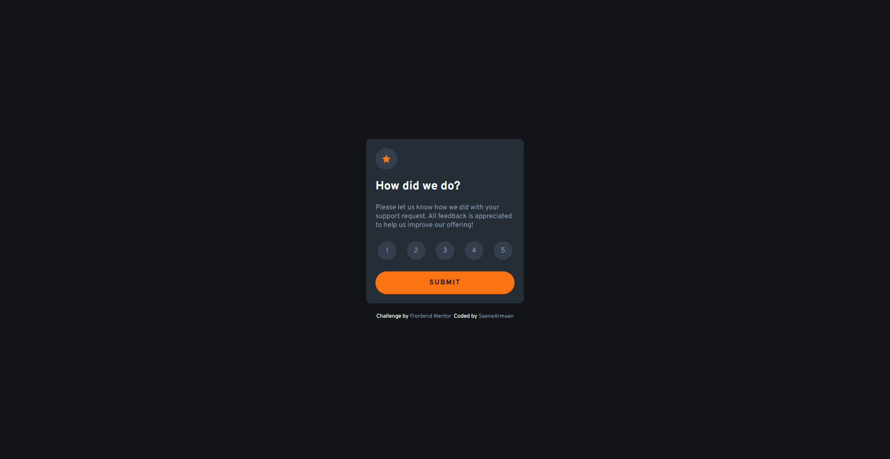

# Frontend Mentor - Interactive rating component solution

This is a solution to the [Interactive rating component challenge on Frontend Mentor](https://www.frontendmentor.io/challenges/interactive-rating-component-koxpeBUmI). Frontend Mentor challenges help you improve your coding skills by building realistic projects.

## Table of contents

- [The challenge](#the-challenge)
- [Screenshot](#screenshot)
- [Links](#links)
- [Built with](#built-with)
- [Continued development](#continued-development)
- [Author](#author) .

### The challenge

Users should be able to:

- View the optimal layout for the app depending on their device's screen size
- See hover states for all interactive elements on the page
- Select and submit a number rating
- See the "Thank you" card state after submitting a rating

### Screenshot

### Links

- Solution URL: [Solution](https://github.com/SaeneArmaan/Interactive-Rating-Component)
- Live Site URL: [Live URL](https://interactive-rating-component-saene.netlify.app/)

### Built with

- Semantic HTML5 markup
- CSS custom properties
- Flexbox
- CSS Grid
- Mobile-first workflow

### Continued development

I am trying to add a little animation whenever user click on submit button

## Author

- Frontend Mentor - [@SaeneArmaan](https://www.frontendmentor.io/profile/SaeneArmaan)
- Twitter - [@Armaan2Saini](https://x.com/Armaan2Saini)
